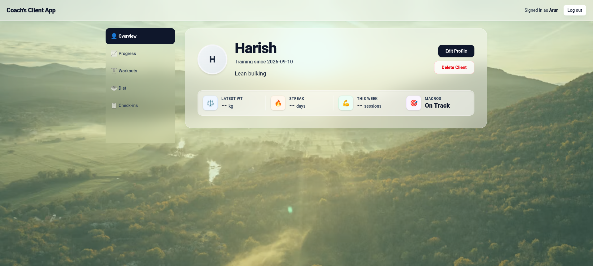
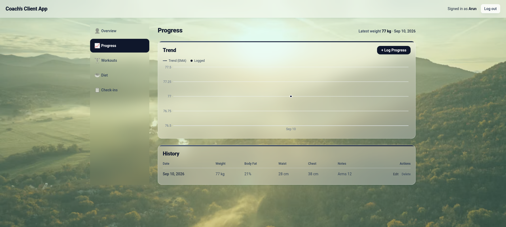
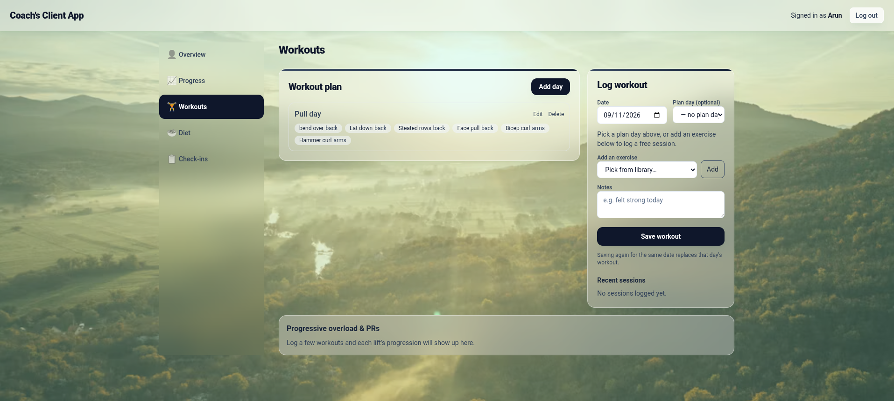

# Coach's Client App

A private, single-user web app built for a gym coach to manage his 
clients' progress, workouts, diet, and check-ins — all in one place. 
Built as a personal project.

## Screenshots

## Features

- Client management (add/edit/delete client profiles)
- Progress tracking with EMA-smoothed weight/measurement trend graphs
- Workout logging with progressive-overload and PR tracking
- Diet/macro tracking with daily food logging, water, and supplements
- Weekly check-ins and a private coach's log
- Gamification (built, currently feature-flagged off for a future release)
- Mobile-first design: bottom tab bar on phone, sidebar-style navigation 
  on desktop
- Soft glassmorphism visual theme

## Tech Stack

- **Frontend:** React, Vite, Tailwind CSS
- **Backend:** Node.js, Express (ESM)
- **Database:** Turso (hosted LibSQL/SQLite) via @libsql/client
- **Auth:** express-session with bcrypt password hashing
- **Deployment:** Render

## Running Locally

1. `npm install`
2. Copy `server/.env.example` to `server/.env` and fill in your own values
3. `npm run seed -w server` to create the coach account
4. `npm run dev` to start client + server together
5. Open http://localhost:5173

## Notes

This is a private, single-user tool built for one specific coach's 
workflow — not a general-purpose or multi-tenant product.
